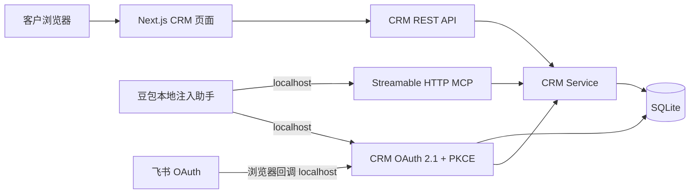
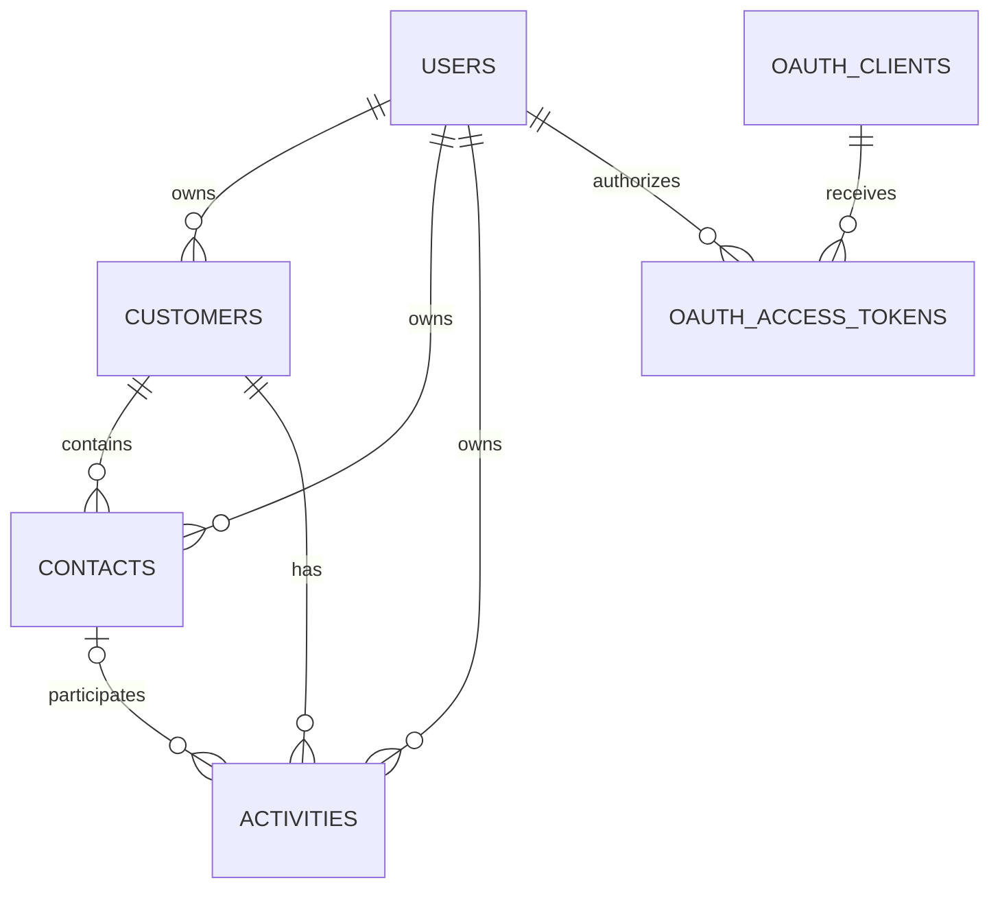
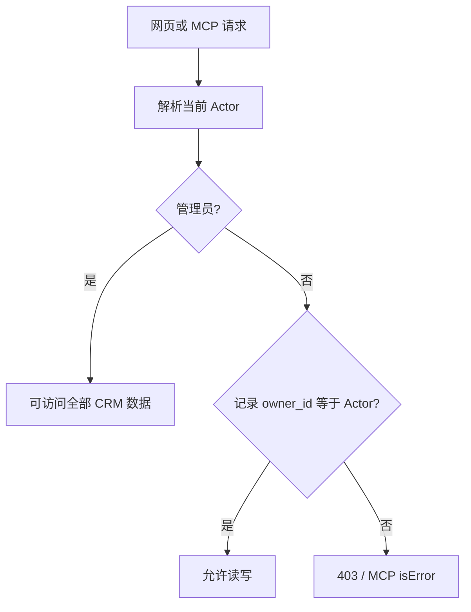
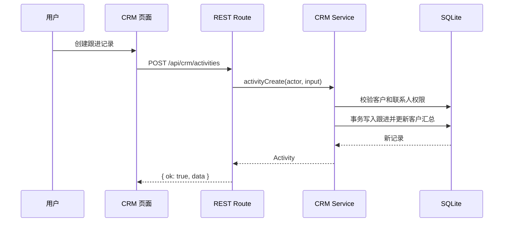

# 技术架构

## 设计目标

项目只保留 CRM 业务和标准协议能力。网页、REST 和 MCP 使用同一个 `CrmService`，因此权限、校验和数据更新行为不会出现三套实现。

本地 TLS 由 mkcert 证书和 Next.js HTTPS 入口负责；部署步骤见[本地 HTTPS 部署](local-https.md)。

## 分层职责

| 层 | 职责 | 不负责 |
| --- | --- | --- |
| React 页面 | 展示、筛选、表单、账号切换 | 业务权限与数据持久化 |
| REST Route | HTTP 输入输出与状态码 | 重复实现业务规则 |
| MCP Route | 协议、Session、工具调用 | 直接读写数据库 |
| 飞书 OAuth | 登录用户并提供稳定 `open_id` | 发放 CRM/MCP Token |
| CRM OAuth | 动态注册、授权码、PKCE、Token | CRM 数据权限判断 |
| CRM Service | 校验、权限、关联关系、汇总 | HTTP/MCP 协议细节 |
| SQLite | 持久化与外键约束 | 用户界面 |

## 数据模型

- `users`：CRM 用户，角色为 `admin` 或 `sales`，可唯一绑定飞书 `open_id` 与头像。
- `customers`：客户生命周期、负责人和跟进汇总。
- `contacts`：属于一个客户，并继承客户负责人。
- `activities`：属于一个客户，可选关联联系人；新增跟进会同步客户最近/下次跟进时间。
- OAuth 表：客户端、待确认请求、一次性授权码、Access Token、Refresh Token。

OAuth code 与 token 同时保存 CRM `user_id` 和飞书 `open_id`。网页仍可自由切换演示账号，而 MCP 始终使用授权时的真实飞书绑定；账号停用或绑定变化后旧 Token 失效。

## 权限模型

管理员创建客户时可以指定负责人。销售创建客户时负责人强制为本人；联系人和跟进记录继承关联客户的负责人。

## 请求链路

网页操作：

MCP 调用和 REST 的区别只在入口，进入 `CrmService` 后行为相同。

## 运行与持久化

- SQLite 默认文件：`data/crm.sqlite`。
- 数据库启用 WAL，便于本地页面和 MCP 并发读取。
- OAuth Token 持久化，Next.js 重启后仍有效；MCP Session 位于内存，重启后需重新 initialize。
- `bun run db:reset` 会清除 CRM 和 OAuth 数据并恢复演示初始状态。
