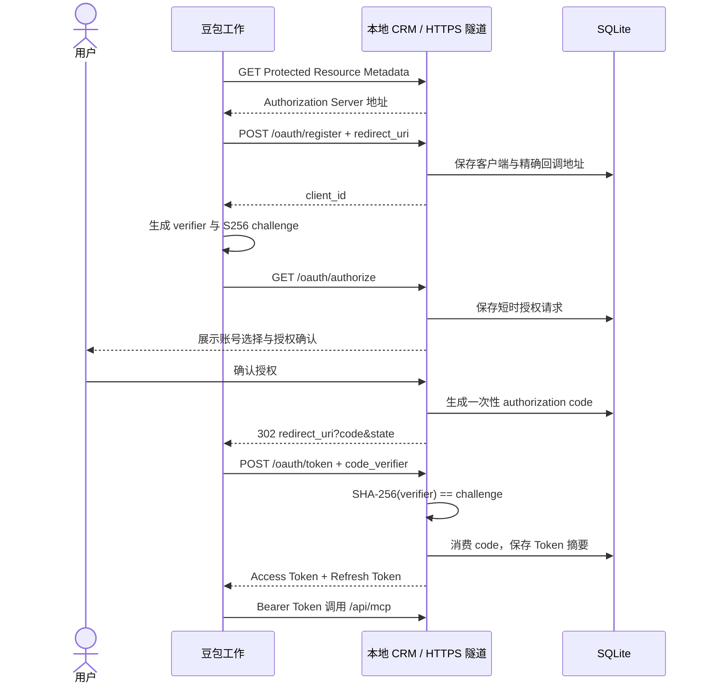

# OAuth 2.1 与 PKCE

## 为什么本项目需要 OAuth

豆包工作必须知道“当前 MCP 调用代表哪个 CRM 用户”。OAuth 将浏览器里选择的演示账号绑定到 Access Token；之后每次 MCP 请求携带 Token，服务端恢复对应用户及权限。

## 完整授权链路



## “回调到本地”到底指什么

服务代码和数据库都运行在本地。为了让豆包访问本机，`cloudflared` 把一个临时 HTTPS 地址转发到 `localhost:3000`：

```text
豆包 → https://临时域名/oauth/* → cloudflared → localhost:3000/oauth/*
豆包 → https://临时域名/api/mcp → cloudflared → localhost:3000/api/mcp
```

OAuth 的 `redirect_uri` 属于客户端豆包。授权确认后，本地服务必须把授权码重定向给豆包，豆包才能调用 `/oauth/token`。因此最终地址栏落在豆包域名是正确行为，不代表 MCP 运行在云端。

## PKCE 的作用

豆包先生成只有自己知道的随机 `code_verifier`，只把它的 SHA-256 结果 `code_challenge` 发给授权服务器。即使授权码被截获，没有原始 verifier 也无法换取 Token。

服务端规则：

- `code_challenge_method` 必须为 `S256`。
- verifier/challenge 长度和字符集必须符合 PKCE。
- 授权码有效期 5 分钟且只能消费一次。
- `client_id`、`redirect_uri` 和 challenge 必须与授权请求完全一致。

## Token 生命周期

| 凭证 | 有效期 | 是否一次性 | 存储方式 |
| --- | ---: | --- | --- |
| Authorization Code | 5 分钟 | 是 | SHA-256 摘要 |
| Access Token | 1 小时 | 否 | SHA-256 摘要 |
| Refresh Token | 30 天 | 每次刷新轮换 | SHA-256 摘要 |

撤销端点同时支持 Access Token 和 Refresh Token。数据库泄露时不会直接暴露可用 Token 明文。

## 安全检查

- 动态注册最多接受 10 个回调地址。
- 回调默认必须为 HTTPS；仅 localhost/127.0.0.1 允许 HTTP。
- 授权时严格匹配登记过的完整 `redirect_uri`。
- 授权确认使用一次性数据库请求和 CSRF 值，表单不能修改 OAuth 原始参数。
- Token 与启用的 CRM 用户绑定；用户停用后 Token 无法继续调用 MCP。
