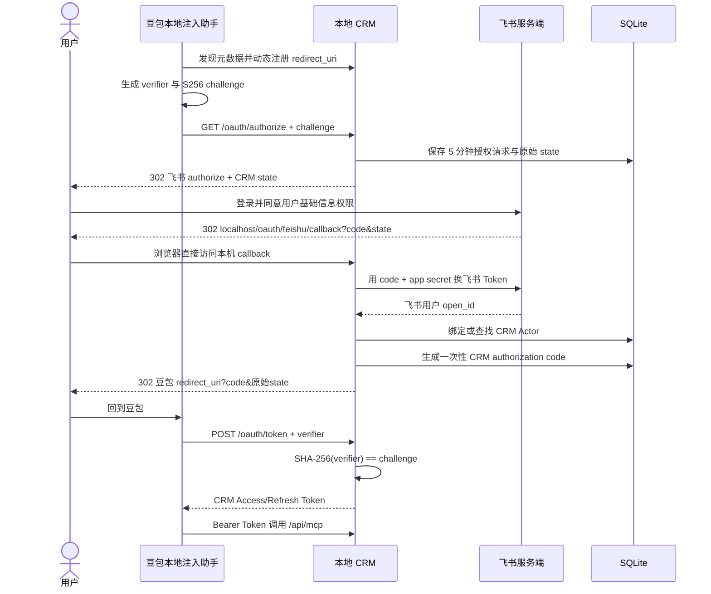

# 豆包、飞书与 CRM 的双层 OAuth

本项目包含两段连续但用途不同的授权：豆包通过 OAuth 2.1 + S256 PKCE 获取 MCP Token；在发放这个 Token 前，CRM 再通过飞书 OAuth 确认真实用户。CRM 不会把飞书 Access Token 交给豆包，也不会把飞书密钥写入数据库或日志。

## 两类地址

| 地址 | 谁访问 | 示例 |
| --- | --- | --- |
| MCP 与 CRM OAuth 本地入口 | 豆包本地注入助手 | `https://localhost:3000/api/mcp`、`https://localhost:3000/oauth/*` |
| 飞书浏览器回调 | 用户浏览器 | `https://localhost:3000/oauth/feishu/callback` |

在飞书开放平台将本地回调逐字登记为“重定向 URL”。豆包助手最终回调使用它动态注册的随机 `127.0.0.1` 端口，这与飞书回调是两个不同地址。

本地证书、系统信任和一键启动流程见[本地 HTTPS 部署](local-https.md)。

## 完整链路



## 身份绑定规则

1. 相同飞书 `open_id` 每次登录都返回同一个 CRM 用户。
2. 第一个成功登录的飞书用户绑定 `user_admin`。
3. 第二、第三位用户依次绑定 `user_alice`、`user_bob`。
4. 内置销售账号用完后，新登录用户会创建新的销售账号。
5. 飞书名称和头像在登录时更新；已停用账号拒绝授权。

绑定在 SQLite immediate transaction 内完成，并由 `feishu_open_id` 唯一索引避免并发首次登录产生两个管理员。

## PKCE 与 Token 安全

豆包保留随机 `code_verifier`，只发送它的 SHA-256 结果。截获授权码的人没有 verifier 就无法换 Token。

| 凭证 | 有效期 | 规则 |
| --- | ---: | --- |
| CRM Authorization Code | 5 分钟 | 一次性，绑定 client、redirect URI、PKCE、CRM 用户和飞书身份 |
| CRM Access Token | 1 小时 | 数据库只保存 SHA-256 摘要 |
| CRM Refresh Token | 30 天 | 每次刷新轮换，数据库只保存摘要 |

每次 MCP 调用和刷新都会重新检查：CRM 用户仍启用，且当前 `feishu_open_id` 与 Token 中的绑定一致。修改绑定或停用账号会让旧 Token 失效。

## 配置

```dotenv
APP_BASE_URL=https://localhost:3000
LARK_APP_ID=cli_xxx
LARK_APP_SECRET=xxx
FEISHU_OAUTH_REDIRECT_URI=https://localhost:3000/oauth/feishu/callback
```

飞书应用需要用户基础信息权限 `contact:user.base:readonly`。错误页只显示失败阶段和安全提示，日志只记录阶段、错误类型与消息，不记录 code、Token 或密钥。
